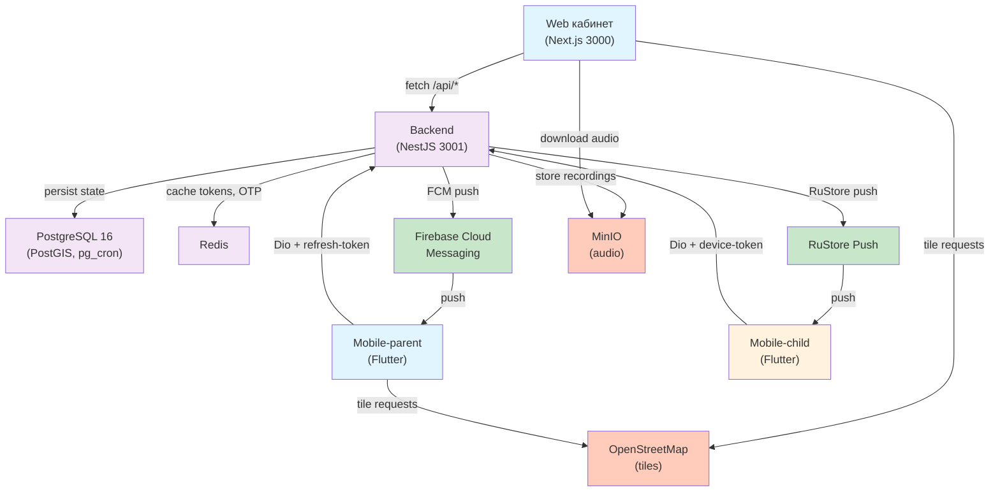
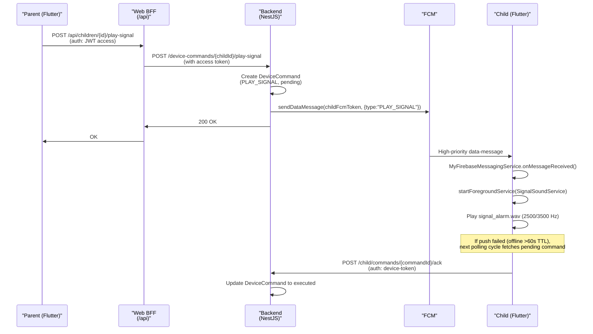
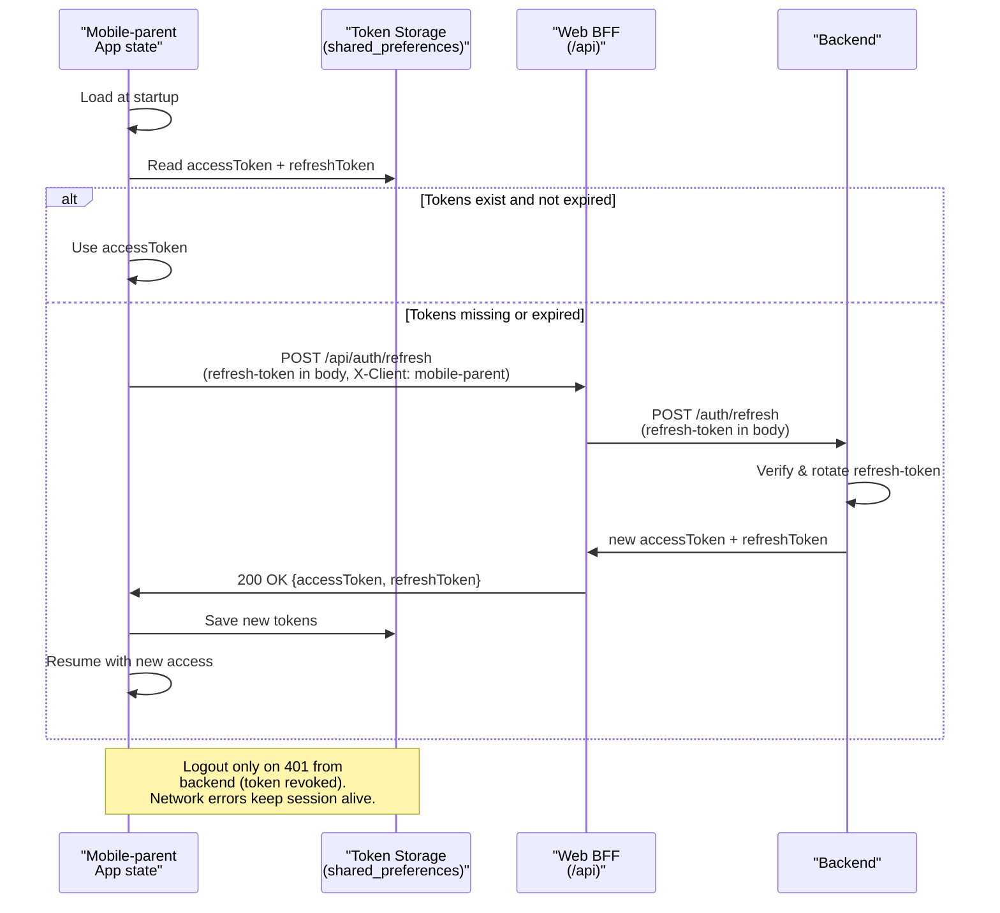

# Перископ Engineering Documentation

**Перископ** — сервис родительского контроля и геолокации детей. Self-hosted аналог сервиса вроде [gdemoideti.ru](https://gdemoideti.ru) для РФ-рынка с соответствием 152-ФЗ. Бренд-переименование с GMD.

**Current version:** 0.51.0  
**Repository root:** `D:/Project/GMD`  
**Production:** periscop.pro (VPS 45.67.230.87, Ubuntu 24.04, single iface ens3); Legacy API: gmd-online.ru  
**Last updated:** 2026-05-15 (миграция на новый домен и ребрендинг)

---

## Содержание

- [Обзор продукта](#обзор-продукта)
- [Технологический стек](#технологический-стек)
- [Архитектура системы](#архитектура-системы)
- [Структура монорепо](#структура-монорепо)
- [Backend архитектура](#backend-архитектура)
- [Аутентификация и авторизация](#аутентификация-и-авторизация)
- [Mobile-parent](#mobile-parent)
- [Mobile-child](#mobile-child)
- [Web (Next.js)](#web-nextjs)
- [База данных](#база-данных)
- [Версионирование и релизы](#версионирование-и-релизы)
- [Инфраструктура и деплой](#инфраструктура-и-деплой)
- [Ключевые архитектурные решения](#ключевые-архитектурные-решения)
- [Где обновлять этот документ](#где-обновлять-этот-документ)

---

## Обзор продукта

### MVP-фичи Перископа

Родитель в едином приложении получает:

1. **GPS-геолокация ребёнка** (Android) + история 30 дней (retention через `pg_cron`)
2. **Геозоны** с push-уведомлениями при входе/выходе (PostGIS фильтрация, FCM high-priority)
3. **SOS-кнопка** от ребёнка — родитель получает сирену (sweep 600↔1300 Hz, 12 сек, в DND-режиме)
4. **Читаемая статистика экранного времени** Android (Usage Stats API, block sessions)
5. **«Звук вокруг ребёнка»** (Перископа) — аудиомониторинг с микрофона по запросу (Android only), WebSocket relay 5-минутные сессии
6. **Сигнал («Найди телефон»)** — FCM high-priority с fallback на poll-очередь (1–3 сек delivery, 2500/3500 Hz квадратные волны)
7. **Защита от удаления** (Device Admin + AccessibilityService на mobile-child)
8. **Web-кабинет** (Next.js 15, TypeScript, responsive, dark theme, Zustand auth)
9. **Mobile-parent** (Flutter 3.24+, Android + iOS в плане) и **mobile-child** (Flutter, Android-only)
10. **Persistent login** на mobile-parent (refresh-token 30d в `shared_preferences`, resilient к kill app — см. [ADR-secure-storage](#5-shared_preferences-вместо-flutter_secure_storage-mobile-parent))

### Что НЕ в MVP

GPS-часы, чат, iOS mobile-child, мониторинг соцсетей, платные подписки, мониторинг звонков/SMS.

---

## Технологический стек

| Слой                        | Технология                                                                      | Примечание                                                             |
| --------------------------- | ------------------------------------------------------------------------------- | ---------------------------------------------------------------------- |
| **Mobile parent**           | Flutter 3.24, Dart 3.11.5, Riverpod, GoRouter 14.6                              | Android + iOS (iOS after MVP)                                          |
| **Mobile child**            | Flutter 3.24, Dart 3.11.5, Drift SQLite, WorkManager                            | Android-only; Device Admin, AccessibilityService                       |
| **Web**                     | Next.js 15 (App Router), TypeScript 5.6, Tailwind, shadcn/ui, Zustand           | Лендинг + кабинет + embed-pages                                        |
| **API**                     | REST (no OpenAPI codegen yet; types manual TS/Dart)                             | `/api` Caddy-проксирует на backend:3001                                |
| **Backend**                 | NestJS, TypeScript, Prisma ORM                                                  | Модульная архитектура, guards, pipes, interceptors                     |
| **Database**                | PostgreSQL 16 + PostGIS + pg_cron                                               | Мигрируется Prisma, schema.prisma = source of truth                    |
| **Realtime**                | FCM data-message high-priority; short-polling child→backend                     | Без WebSocket на MVP (кроме audio relay)                               |
| **Audio relay**             | WebSocket (Opus 20ms@16kHz mono → AudioWorklet)                                 | Embedded в `/embed/audio/[childId]` (web)                              |
| **Maps**                    | OpenStreetMap (flutter_map 7.0.2, react-leaflet 5)                              | Без ключей, без санкционных рисков; CartoDB Dark Matter для dark-theme |
| **Geocoding**               | Yandex Geocoder (backend proxy)                                                 | Переезд на другой геокодер в плане                                     |
| **Caching**                 | Redis (sessions, OTP)                                                           | Управляется через docker-compose                                       |
| **Storage**                 | MinIO (S3-compatible)                                                           | Для аудиосессий (не на MVP, но infra готова)                           |
| **Auth tokens**             | JWT: access 15m + refresh 30d                                                   | Mobile → refresh из body; web → HttpOnly cookie + body для mobile      |
| **Auth method**             | Email + OTP (SMS когда будет Twilio или RuSMS)                                  | Версионированное согласие на регистрацию (152-ФЗ)                      |
| **Passwords**               | Argon2id (backend hashing)                                                      | ParentPin тоже на User-уровне, Argon2                                  |
| **Logging**                 | GlitchTip (Sentry-compatible)                                                   | В production; dev → console                                            |
| **Monitoring**              | Grafana + Loki + Prometheus                                                     | Доступ через SSH-tunnel: `ssh -N gmd-online-tunnels`                   |
| **Uptime**                  | Uptime Kuma                                                                     | Health endpoints: `/healthz` (liveness), `/readyz` (readiness)         |
| **Container orchestration** | Docker Compose (production и development)                                       | Нет K8s; Caddy как reverse-proxy + auto-TLS                            |
| **CI/CD**                   | Husky + lint-staged (pre-commit)                                                | GitHub Actions когда будет выбран git-хостинг                          |
| **Package managers**        | pnpm 9.15.0 (JS/TS), Melos (Flutter)                                            | Monorepo с Turborepo                                                   |
| **Build tools**             | Gradle (mobile-child native), Next.js build (web), NestJS compilation (backend) | Версия Node 22+, Dart 3.11.5+, Flutter 3.24+                           |

---

## Архитектура системы

### Обзор взаимодействия



### Request flow: mobile-parent → backend → mobile-child (команды через FCM)



### Persistent login flow (mobile-parent)



---

## Структура монорепо

```
D:/Project/GMD/
├── apps/
│   ├── backend/                      # NestJS API server (port 3001)
│   │   ├── src/
│   │   │   ├── auth/                 # JWT, OTP, email verification, password, PIN
│   │   │   ├── users/                # User entity, profiles
│   │   │   ├── families/             # Family CRUD, multi-parent, soft-delete
│   │   │   ├── children/             # Child CRUD, protection flag, soft→hard delete
│   │   │   ├── child-device/         # DeviceToken management, lastSeenAt, revocation
│   │   │   ├── invites/              # QR-invite generation, reset-device
│   │   │   ├── consent/              # Versioned consent agreement, ConsentRequiredGuard
│   │   │   ├── locations/            # Point ingestion, latest, history, tracks, geofencing
│   │   │   ├── zones/                # Geofences (PostGIS), enter/exit FCM push
│   │   │   ├── sos/                  # SOS button, FCM siren to parent
│   │   │   ├── app-control/          # Usage stats, installed apps, block sessions, rules
│   │   │   ├── device-commands/      # PLAY_SIGNAL, audio-session-start (FCM + poll queue)
│   │   │   ├── audio/                # Audio session management, WebSocket relay
│   │   │   ├── parent-devices/       # FCM tokens for parent (multi-device)
│   │   │   ├── fcm/                  # Firebase Cloud Messaging wrapper
│   │   │   ├── mailer/               # Email service (OTP, password reset)
│   │   │   ├── health/               # /healthz, /readyz
│   │   │   ├── admin/                # Admin-only endpoints
│   │   │   ├── common/               # Guards, pipes, interceptors, decorators
│   │   │   └── prisma/               # Prisma client, migrations
│   │   ├── prisma/
│   │   │   └── schema.prisma         # Database schema (source of truth)
│   │   ├── .env.example
│   │   └── package.json
│   │
│   ├── web/                          # Next.js 15 (port 3000) — лендинг + кабинет
│   │   ├── app/
│   │   │   ├── (public)/             # Landing, login, register, claim-invite
│   │   │   ├── cabinet/              # Parent dashboard
│   │   │   │   ├── children/[id]/map
│   │   │   │   ├── children/[id]/parental-control
│   │   │   │   └── zones
│   │   │   ├── embed/                # WebView embed pages (JWT in hash)
│   │   │   │   ├── audio/[childId]   # Audio listen session (active)
│   │   │   │   └── parental-control/[childId]  # (planned)
│   │   │   ├── admin/                # Admin UI (role: admin only)
│   │   │   ├── api/                  # BFF routes — proxy to backend + refresh handling
│   │   │   │   ├── auth/refresh/
│   │   │   │   └── geocode/
│   │   │   ├── globals.css           # Tailwind, leaflet-dark theme
│   │   │   └── layout.tsx            # Root layout, providers
│   │   ├── lib/
│   │   │   ├── api/client.ts         # apiFetch() with auto-refresh on 401
│   │   │   ├── auth-store.ts         # Zustand + persist (user, family, tokens)
│   │   │   ├── backend.ts            # Direct backend call from BFF routes
│   │   │   ├── maps/                 # TileConfig (light/dim/dark OSM/CartoDB)
│   │   │   └── api/                  # Type definitions (manual, no OpenAPI codegen)
│   │   ├── components/               # shadcn/ui + custom
│   │   ├── .env.example
│   │   └── package.json
│   │
│   ├── mobile-parent/                # Flutter (Android, iOS in plan)
│   │   ├── lib/
│   │   │   ├── core/
│   │   │   │   ├── api/              # Dio client + interceptors + refresh
│   │   │   │   ├── auth/             # AuthSession provider, shared_preferences token storage
│   │   │   │   ├── config/           # env.dart (API_BASE_URL, WEB_ORIGIN)
│   │   │   │   ├── fcm/              # ParentFcmRegistrar, push channels
│   │   │   │   ├── providers.dart    # Global Riverpod providers
│   │   │   │   └── storage/
│   │   │   ├── features/
│   │   │   │   ├── audio/            # AudioListenScreen (WebView embed)
│   │   │   │   ├── auth/             # Login, register, password-reset screens
│   │   │   │   ├── children/         # Repository, providers, list screen
│   │   │   │   ├── child_detail/     # Map (flutter_map OSM) + track + zones
│   │   │   │   ├── home/             # Bottom-nav home, children summary
│   │   │   │   └── splash/           # Splash + auth-gate
│   │   │   ├── router/               # GoRouter config, auto-login redirect
│   │   │   ├── main.dart
│   │   │   └── theme.dart
│   │   ├── android/                  # Gradle, Android-specific config
│   │   ├── ios/
│   │   ├── pubspec.yaml
│   │   └── .env.example
│   │
│   └── mobile-child/                 # Flutter Android-only
│       ├── lib/
│       │   ├── core/
│       │   │   ├── api/              # Dio + device-token auth header
│       │   │   ├── config/
│       │   │   ├── database/         # Drift SQLite (location history, commands)
│       │   │   ├── fcm/              # Firebase messaging + RuStore push
│       │   │   ├── foreground/       # ForegroundService for tracking + permissions
│       │   │   ├── location/         # FusedLocationProvider, speed-based profile
│       │   │   ├── providers.dart    # Global state
│       │   │   └── storage/
│       │   ├── features/
│       │   │   ├── app-control/      # Usage stats, block UI, app rules
│       │   │   ├── device-setup/     # Initial Device Admin + A11y flow, wizard
│       │   │   ├── home/             # Main screen (status tile + buttons)
│       │   │   ├── protection/       # Device Admin + AccessibilityService
│       │   │   ├── location/         # Manual location, track view
│       │   │   └── debug/            # DiagLog screen (/debug long-press)
│       │   ├── router/               # GoRouter config
│       │   ├── main.dart
│       │   └── theme.dart
│       ├── android/                  # Kotlin: native services, Device Admin
│       │   ├── app/src/main/
│       │   │   ├── AndroidManifest.xml
│       │   │   ├── kotlin/
│       │   │   │   ├── MainActivity.kt
│       │   │   │   ├── LocationForegroundService.kt
│       │   │   │   ├── LocationUpdateReceiver.kt
│       │   │   │   ├── BootReceiver.kt
│       │   │   │   ├── UpdateCheckWorker.kt (WorkManager)
│       │   │   │   ├── MyFirebaseMessagingService.kt (FCM receive)
│       │   │   │   ├── SignalSoundService.kt
│       │   │   │   ├── ProtectionReceiver.kt (Device Admin callbacks)
│       │   │   │   ├── NativeCreds.kt (KeyStore integration)
│       │   │   │   └── AppControlHttp.kt
│       │   │   └── res/
│       │   │       └── raw/
│       │   │           └── signal_alarm.wav (2500/3500 Hz, custom siren)
│       │   └── build.gradle.kts
│       ├── pubspec.yaml
│       └── .env.example
│
├── packages/                         # Shared (пока пусто, OpenAPI codegen не настроен)
│   └── shared-types/                 # Placeholder for TS types codegen
│
├── infra/
│   ├── docker/
│   │   ├── docker-compose.dev.yml    # dev: postgres:54320, redis:63790, minio:9050/9051
│   │   ├── docker-compose.prod.yml   # prod: мониторинг, backups
│   │   ├── .env.dev                  # LOCAL OVERRIDES (in .gitignore)
│   │   ├── .env.example
│   │   └── Dockerfile.*              # Per-service Dockerfile if needed
│   ├── caddy/
│   │   ├── Caddyfile                 # Reverse proxy, auto-TLS, middleware
│   │   └── config.json               # (optional, if config-driven)
│   └── deploy/
│       ├── deploy.sh                 # SSH deploy to 45.67.230.87
│       ├── backup.sh                 # pg_dump + restore
│       └── migrate.sh                # Prisma migration on prod
│
├── docs/
│   ├── engineering/
│   │   └── PROJECT.md                # THIS FILE — single source of truth for engineers
│   ├── superpowers/
│   │   ├── specs/                    # Architecture + design docs (per-feature)
│   │   │   ├── 2026-04-18-gmd-mvp-design.md
│   │   │   ├── 2026-04-23-gmd-sound-around-design.md
│   │   │   ├── 2026-04-26-gmd-phase6-app-control.md
│   │   │   └── [... other specs]
│   │   └── plans/                    # Implementation plans (oперативные)
│   ├── legal/
│   │   ├── privacy-policy-v1.1.md    # 152-ФЗ compliant, versioned consent
│   │   └── terms-of-use-v1.0.md
│   ├── 152fz-checklist.md            # Data retention, compliance audit
│   ├── audio-api.md                  # Audio session protocol (WebSocket)
│   ├── database.md                   # Schema + ERD + table descriptions
│   ├── deploy.md                     # Deployment runbook
│   ├── backup-restore.md             # PG backup + anonymize for dev
│   ├── server-hardening.md           # Security hardening steps
│   ├── monitoring.md                 # GlitchTip, Uptime Kuma, Grafana
│   ├── runbooks/
│   │   └── 2026-04-24-sound-around-e2e-verification.md
│   └── README.md                     # Docs overview
│
├── scripts/
│   ├── sync-version.mjs              # Sync root package.json → apps/*/package.json, pubspec.yaml
│   ├── gen-sos-siren.mjs             # Generate signal_alarm.wav
│   └── [other utilities]
│
├── CHANGELOG.md                      # SemVer history (v0.46.0 current)
├── CLAUDE.md                         # AI assistant rules + best-practices
├── package.json                      # Root: version 0.46.0 (source of truth)
├── pnpm-workspace.yaml               # Workspace config
├── melos.yaml                        # Melos Flutter workspace
├── tsconfig.json                     # Root TS config
├── turbo.json                        # Turborepo build cache config
├── .gitignore
└── README.md                         # Project overview

# Key files (per layer)
- Frontend state: apps/web/lib/auth-store.ts (Zustand + persist)
- Backend DI: apps/backend/src/app.module.ts
- DB schema: apps/backend/prisma/schema.prisma
- API routes: apps/backend/src/{module}/{module}.controller.ts
- Next.js BFF: apps/web/app/api/auth/refresh/route.ts
- Mobile-parent auth: apps/mobile-parent/lib/core/auth/auth_session.dart
```

---

## Backend архитектура

### Модули и их責務

**Authentication & Security:**

- `auth/` — JWT issue/verify, OTP generation + delivery, email verification, password reset, PIN management
- `consent/` — Versioned consent agreements (152-ФЗ), `ConsentRequiredGuard` для new features
- `users/` — User entity, profile, locale, soft-delete + 30-day hard-delete

**Family & Children:**

- `families/` — Family CRUD, multi-parent ownership, cascading soft-delete
- `children/` — Child entity, protectionEnabled flag, soft/hard delete workflow
- `child-device/` — Device tokens, lastSeenAt tracking, revocation (device reset)
- `invites/` — QR generation + claiming for device binding

**Location & Geofencing:**

- `locations/` — Point ingestion from mobile-child, PostGIS distance queries, location history + retention
- `zones/` — Geofence CRUD (PostGIS ST_DWithin), enter/exit event detection, FCM push dispatch

**Child Monitoring:**

- `app-control/` — Usage stats (ANDROID_USAGE_STATS), installed apps list, block sessions, per-app rules (ALWAYS_ALLOWED/DEFAULT/ALWAYS_BLOCKED)
- `sos/` — SOS button state, FCM siren push (priority HIGH)
- `audio/` — Audio session lifecycle, WebSocket relay management

**Parent Communication:**

- `device-commands/` — Pending commands (PLAY_SIGNAL, audio-start, etc.), polling queue, idempotent ack
- `parent-devices/` — FCM tokens per parent device (multi-device support), token revocation on invalid

**Infrastructure:**

- `fcm/` — Firebase Admin SDK wrapper (sendDataMessage, sendNotification, token validation)
- `mailer/` — Email service (OTP delivery, password reset)
- `health/` — Liveness + readiness probes
- `admin/` — Tenant management, data retention cleanup triggers
- `redis/` — Cache service wrapper
- `common/` — `JwtAuthGuard`, `ZodValidationPipe`, `ExceptionFilter`, `LoggingInterceptor`

### Key Controllers

**For parent UI (web + mobile-parent):**

- `families/{id}/children/*` — child CRUD, invite generation
- `children/{id}/map` — latest location, history, tracks
- `children/{id}/zones` — geofence CRUD, enter/exit events
- `children/{id}/app-control/*` — usage stats, block sessions, app rules
- `children/{id}/audio/*` — audio session start/end
- `parents/devices/fcm-token` — register/revoke parent FCM tokens, with throttle 30/min

**For child device (mobile-child):**

- `child/location` — ingest location points (FusedLocationProvider)
- `child/commands/poll` — fetch pending commands
- `child/commands/{id}/ack` — ack command execution
- `child/app-control/usage-stats` — post usage report
- `health/device-heartbeat` — keep lastSeenAt alive

### Key Services & Patterns

**Transactional consistency:**

- Prisma transactions for multi-table updates (e.g., invite claim → device token create + child link)
- Optimistic locking via `updatedAt` where needed

**Event streaming (implicit):**

- `ZoneDetectionService` watches location ingestion, emits enter/exit, triggers FCM
- `SosService` on SOS button, emits FCM priority HIGH
- `DeviceCommandsService` batch-creates pending commands with FCM fallback

**Idempotency:**

- `DeviceCommandsService.ackCommand` — idempotent on already-executed commands
- Device token registration — idempotent PUT vs POST

**Rate-limiting (Throttle decorator):**

- Auth endpoints: 3–10/10min (OTP enumerate protection)
- Refresh: 30/min (brute-force refresh rotation)
- Parent FCM register: 30/min (prevent spam)

---

## Аутентификация и авторизация

### Workflow: Email + OTP

```
1. POST /auth/request-otp {email}
   → OtpService.requestOtp(email)
   → User exists + emailVerified + not blocked?
   → Generate 6-digit code + 10min TTL
   → OtpProvider (SmtpOtpProvider / FakeOtpProvider) sends code
   → 200 OK {expiresIn: 600}

2. POST /auth/verify-otp {email, code}
   → OtpService.verifyOtp(email, code)
   → Match code + TTL
   → JwtService.issue(userId) → {accessToken, refreshToken}
   → RefreshTokenService.create(tokenHash, metadata) → refresh entry in DB
   → 200 OK {accessToken, refreshToken, user, family}

3. User not found? → 404 {code: 'user_not_found'} (UX decision)

4. For web: accessToken in response, refreshToken in HttpOnly cookie
   For mobile: both in response + X-Client: mobile-parent header logic
```

### JWT Structure

```
access_token: {
  iss: "gmd",
  sub: userId,
  aud: ["gmd"],
  exp: now + 15min,
  iat: now,
  type: "access"
}

refresh_token: {
  iss: "gmd",
  sub: userId,
  aud: ["gmd"],
  exp: now + 30d,
  iat: now,
  type: "refresh",
  tokenId: (refresh_token.id from DB)
}
```

### Token Refresh Flow (dual-channel)

```
POST /api/auth/refresh (from web or mobile-parent)

Web (browser):
  Request: { refreshToken: null } (token in HttpOnly cookie)
  Response: { accessToken } (refreshToken in new HttpOnly cookie)

Mobile-parent (Dio, X-Client: mobile-parent):
  Request: { refreshToken: "..." } (in body, no cookie-jar)
  Response: { accessToken, refreshToken } (both in JSON body)

Logic in apps/web/app/api/auth/refresh/route.ts:
  isMobile = req.headers.get('x-client')?.startsWith('mobile')
  if (!isMobile) → cookie-only (web pattern)
  if (isMobile) → JSON body (mobile pattern)
```

### Device Token Authentication (mobile-child)

Long-lived opaque token (device-specific, no expiry):

- Generated on first claim of invite (InviteService.claimInvite)
- Stored in native KeyStore (Android) via `NativeCreds.kt`
- Sent as `X-Child-Token` header on every request
- Server validates against `child_device.token` record
- Revoked via `POST /child/reset-device` or admin action

No JWT needed for child — simpler, device-bound lifecycle.

### PIN Management (Parent Protection)

```
POST /auth/set-password {password}  // Password for email+OTP or password login

POST /auth/set-pin {pin}            // 4-digit PIN for quick unlock on mobile-parent
                                     // Stored as Argon2 hash on User entity
                                     // GuardedBy JwtAuthGuard

Usage: parent opens mobile-parent after app kill
  → splash checks shared_preferences (accessToken present?)
  → if not → PIN unlock (numeric keyboard) OR email+OTP
  → verifyPin(pin) → success → stay on app
```

### Consent & 152-ФЗ Compliance

```
User.acceptedPrivacyPolicyVersion = "1.1"  (versioned)

POST /auth/register {email, code, acceptedPrivacyPolicyVersion}
  → validates version matches current config
  → stores acceptance in User record

New features requiring consent:
  @UseGuards(ConsentRequiredGuard)
  async featureEndpoint() { ... }

  Guard checks: User.acceptedPrivacyPolicyVersion >= requiredVersion
  → 403 {code: 'consent_required'} if outdated
  → Frontend → modal to re-accept → re-call endpoint
```

---

## Mobile-parent

**Platform:** Flutter 3.24+ (Dart 3.11.5)  
**Platforms:** Android primary, iOS in plan  
**State management:** Riverpod 2.6 (not Bloc)  
**Routing:** GoRouter 14.6  
**HTTP client:** Dio 5.7 with refresh-token interceptor  
**Token storage:** `shared_preferences` (НЕ `flutter_secure_storage` — у 9.x на Android 14/15 MIUI/HyperOS теряется EncryptedSharedPreferences MasterKey после рестарта, все ключи возвращают `null`. См. ADR ниже.)

### Features & Screens

1. **Splash + Auth gate** — auto-login via `shared_preferences` token or redirect to login
2. **Auth flows** — login (password), register (OTP), password reset
3. **Home** — bottom-nav with children list (avatar, name, last location, battery)
4. **Child detail** — interactive map (flutter_map 7.0.2 OSM), day-view track, zone list
5. **Audio listen** — WebView embed `/embed/audio/[childId]` with token in hash
6. **Settings** — profile, PIN setup, logout

### Architecture Highlights

**API Layer:**

- `Dio` with custom interceptor for auto-refresh
- `X-Client: mobile-parent` header for BFF routing
- Refresh interceptor catches 401 → POST /api/auth/refresh with body token
- On offline or 5xx → keep session alive (no logout)

**Auth Storage:**

- Riverpod provider `authSessionProvider` wraps `shared_preferences` (см. ADR §5)
- На старте app: проверка токенов в splash → relogin via refresh-body → home / login
- Refresh-token retry на 401 в Dio-interceptor

**Map Implementation (Known quirk):**

- flutter_map 7.0.2 requires `Stack(fit: StackFit.expand)` for eager tile fetch
- Without it, map stays grey until user pinches/pans (no tile requests on first frame)
- Impeller (Vulkan renderer) disabled on mobile-parent (`AndroidManifest.xml` meta `EnableImpeller=false`) due to AHardwareBuffer errors on Xiaomi/HyperOS
- TileLayer uses `ValueKey` + `onMapReady` callback for guaranteed startup

**WebView Pattern (Audio Embed):**

- Heavy web-first screens (audio sessions) use `webview_flutter 4.10`
- Opening `/embed/audio/[childId]#t=<accessToken>&childId=...`
- Web-side: JS reads hash → Zustand auth store → `history.replaceState()` (no hash left)
- JS→native bridge: `JavaScriptChannel('GmdHost')` listens for `close` command → `Navigator.maybePop()`

### Persistence & State

- **FCM token:** registered on startup + after refresh via `ParentFcmRegistrar` (native Firebase setup)
- **Children list:** Riverpod provider with periodic refetch (30s poll)
- **Location updates:** streaming from `/children/{id}/locations` (WebSocket in future)
- **Offline mode:** graceful degradation, stale data displayed with timestamp

---

## Mobile-child

**Platform:** Flutter 3.24+ (Dart 3.11.5), **Android-only on MVP**  
**Key native components:** Kotlin (Gradle), Device Admin, AccessibilityService  
**Foreground services:** Location tracking, Update check  
**Database:** Drift (SQLite) for offline-first location history  
**Permissions:** FINE_LOCATION, ACCESS_COARSE_LOCATION, RECORD_AUDIO, SYSTEM_ALERT_WINDOW (OEM quirks)

### Core Features

1. **Home screen** — status tile (🔒 green locked / 🔓 grey / 🔓 red misconfigured), 4 buttons: Sигнал / Звук / Геозоны / Блокировка
2. **Protection setup** — Device Admin + AccessibilityService wizard (OEM-specific for MIUI/HyperOS «Ограниченные настройки»)
3. **Location tracking** — FusedLocationProvider (Google Play Services) with speed-based profile switching
4. **App control UI** — block sessions, per-app rules, usage stats preview
5. **Debug screen** — DiagLog (via long-press version in header)

### Architecture Highlights

**Device Admin + AccessibilityService (Protection from deletion):**

- Device Admin: listens to device-admin callbacks, blocks uninstall attempts
- AccessibilityService: monitors app lifecycle, enforces block rules
- Status tile reflects **both** server flag (`Child.protectionEnabled`) AND local permission state
- OEM quirks: MIUI/HyperOS block sideload-app a11y unless user grants "Ограниченные настройки" in App Info
- Onboarding wizard walks through per-OEM steps

**Location Tracking:**

- `LocationForegroundService` (Kotlin, uses WorkManager for periodic location updates if needed)
- Speed-based profile: walk (2m/min) vs car (5m/min) → different update intervals
- Offline-first: Drift stores points locally, sync on connectivity change
- FCM high-priority data-message with new location as fallback to polling

**Command Processing:**

- Firebase Messaging service `MyFirebaseMessagingService` receives data-messages (PLAY_SIGNAL, audio-start, etc.)
- Fallback: periodic polling of `/child/commands/poll` every 2 minutes (if no FCM or device offline >60s TTL)
- After execution: `POST /child/commands/{id}/ack` → marks as executed in DB
- PLAY_SIGNAL: starts `SignalSoundService` with `signal_alarm.wav` (custom 2500/3500 Hz siren, 4s looped)

**Auto-update Worker:**

- `UpdateCheckWorker` (CoroutineWorker) runs every 6 hours via WorkManager
- Fetches `/api/public/updates/mobile-child/latest` → compares versionCode
- Downloads APK to `externalCacheDir/updates/`
- Notifies user, tap → installs (via FileProvider)

**Audio Session Management:**

- Parent request → backend creates audio session
- mobile-child receives `audio-session-start` via FCM
- Dart opens WebView embed `/embed/audio/[childId]#t=<token>`
- Backend WebSocket relay: Opus 20ms@16kHz mono → AudioWorklet → MediaStream
- 5-min timeout or parent ends session → close notification

**Impeller Disabled:**

- `AndroidManifest.xml`: `<meta-data android:name="io.flutter.embedding.android.EnableImpeller" android:value="false" />`
- Reason: AHardwareBuffer issues on Xiaomi/HyperOS caused tile-fetch failures in flutter_map

---

## Web (Next.js)

**Framework:** Next.js 15 (App Router), TypeScript 5.6  
**Styling:** Tailwind CSS 3.x, shadcn/ui base components  
**State:** Zustand + persist middleware (localStorage)  
**HTTP client:** Fetch API with `apiFetch()` wrapper  
**Maps:** react-leaflet 5 + OpenStreetMap tiles  
**BFF:** `/app/api/` routes proxying to NestJS backend

### Pages & Layout

```
/                                  # Landing page (hero, features, CTA)
/login                             # Email + password form, reset link
/register                          # Email + OTP, consent checkbox
/claim-invite?code=QR_DATA        # Device claim flow (sets child-id in user context)

/cabinet/                          # Parent dashboard (JwtAuthGuard equivalent)
  /children/[id]/map              # Map + track history by date
  /children/[id]/parental-control # Usage stats, block sessions, app rules
  /zones                          # Geofence CRUD (PostGIS-backed)
  /settings                       # Profile, locale, logout

/embed/audio/[childId]            # WebView-embedded audio listener (#t=token in hash)
/embed/parental-control/[childId] # (planned, for mobile-parent WebView)

/admin/                           # Admin UI (restricted to role:admin)
  /dashboard
  /users
  /audit-log
```

### API Client Pattern

```typescript
// apps/web/lib/api/client.ts
export async function apiFetch<T>(path: string, init: RequestInit = {}): Promise<T> {
  const store = useAuthStore.getState();
  let res = await doFetch(path, init, store.accessToken);

  if (res.status === 401) {
    // Auto-refresh: POST /api/auth/refresh
    const r = await fetch('/api/auth/refresh', { method: 'POST' });
    if (r.ok) {
      const data = await r.json();
      store.setAll(data); // Update Zustand store
      res = await doFetch(path, init, data.accessToken);
    }
  }

  // Parse response + throw ApiError on !res.ok
  const body = await res.json();
  if (!res.ok) throw new ApiError(res.status, body.error?.code, body.error?.message);
  return body;
}
```

**Refresh token handling (Web):**

- BFF route `/api/auth/refresh` reads HttpOnly cookie (no JS access)
- On success: new refresh-token set in HttpOnly cookie, returns `{accessToken, ...user, ...family}`
- On failure (401): clears cookie, returns 401 (frontend redirects to /login)

### Auth Store

```typescript
// apps/web/lib/auth-store.ts
const useAuthStore = create<AuthState>()(
  persist(
    (set) => ({
      accessToken: null,
      user: null,
      family: null,
      setAll: (data) => set(data),
      setAccess: (token) => set({ accessToken: token }),
      logout: () => set({ accessToken: null, user: null, family: null }),
    }),
    {
      name: 'auth-store',
      partialize: (state) => ({ accessToken: state.accessToken }), // Only persist essential
    },
  ),
);
```

Loads from localStorage before first render → parent stays inside cabinet after page refresh.

### Embed Pages (Audio Listener)

```html
<!-- /embed/audio/[childId]#t=<accessToken>&childId=<id> -->

<script>
  const hash = window.location.hash;
  const params = new URLSearchParams(hash.substring(1));
  const token = params.get('t');

  useAuthStore.setAll({ accessToken: token });
  history.replaceState({}, document.title, window.location.pathname);
</script>

<!-- AudioSession component mounts, calls apiFetch() with auth header -->
```

**JS→Flutter bridge:**

```javascript
if (window.GmdHost) {
  window.GmdHost.close(); // Triggers Android -> Flutter Navigator.maybePop()
}
```

### Theme & Dark Mode

```css
/* apps/web/app/globals.css */
.leaflet-dark {
  filter: brightness(0.8) invert(1) contrast(1.2);
}

/* Next.js + Tailwind themes: light, dim, dark */
html[data-theme='dark'] .leaflet-container {
  background: #111; /* vs light #f0f0f0 */
}
```

Tile URLs switch based on theme:

- Light: `https://tile.openstreetmap.org/{z}/{x}/{y}.png`
- Dim/Dark: `https://cartodb-basemaps-a.global.ssl.fastly.net/dark_all/{z}/{x}/{y}.png`

---

## База данных

**DBMS:** PostgreSQL 16 + PostGIS + pg_cron  
**ORM:** Prisma 5  
**Migrations:** Prisma migrate (dev, staging, prod)  
**Source of truth:** `apps/backend/prisma/schema.prisma`

### Key Tables

| Table                   | Purpose                                | Retention                                 |
| ----------------------- | -------------------------------------- | ----------------------------------------- |
| `users`                 | Parent/admin accounts                  | Soft→hard delete (30d)                    |
| `families`              | Family grouping (multi-parent)         | Cascading on delete                       |
| `children`              | Child records (protected entity)       | Soft→hard delete (30d) via pg_cron        |
| `child_devices`         | Device tokens (Android device binding) | Revoked on reset                          |
| `memberships`           | (userId, familyId) joins               | Cascading                                 |
| `locations`             | GPS points from mobile-child           | TTL 30d via pg_cron job                   |
| `zones`                 | Geofences (PostGIS geometry)           | On delete family cascade                  |
| `zone_events`           | Enter/exit history                     | TTL 30d (audit)                           |
| `sos_events`            | SOS button presses                     | TTL 30d                                   |
| `device_commands`       | Pending commands (PLAY_SIGNAL, etc.)   | Auto-purge executed after 5 days          |
| `app_control_rules`     | Per-app block rules                    | On delete child cascade                   |
| `app_sessions`          | Block session history                  | TTL 30d                                   |
| `usage_stats_snapshots` | Hourly aggregates                      | TTL 30d                                   |
| `audio_sessions`        | Audio recording metadata               | TTL 30d (or longer if storing recordings) |
| `parent_devices`        | Parent's FCM tokens                    | Revoked on invalid token                  |
| `refresh_tokens`        | JWT refresh token hashes               | TTL 30d, revoked on reuse                 |
| `otp_codes`             | One-time passwords for login           | TTL 10 min                                |

### Data Retention (152-ФЗ Compliance)

```sql
-- pg_cron jobs (run nightly)
SELECT cron.schedule('delete-old-locations', '0 2 * * *', $$
  DELETE FROM locations WHERE created_at < now() - '30 days'::interval;
$$);

SELECT cron.schedule('hard-delete-users', '0 3 * * *', $$
  DELETE FROM users WHERE deleted_at IS NOT NULL AND deleted_at < now() - '30 days'::interval;
$$);

SELECT cron.schedule('hard-delete-children', '0 4 * * *', $$
  DELETE FROM children WHERE deleted_at IS NOT NULL AND deleted_at < now() - '30 days'::interval;
$$);
```

Soft-delete pattern:

- User requested DELETE /me → `users.deletedAt = now()` (soft)
- Queries filter `WHERE deletedAt IS NULL`
- After 30d → hard delete via cron (GDPR right to be forgotten)

### PostGIS Geofencing

```sql
-- Zone table
CREATE TABLE zones (
  id UUID PRIMARY KEY,
  family_id UUID NOT NULL,
  name VARCHAR,
  geometry GEOMETRY(Point, 4326), -- lat/lon in degrees
  radius_meters FLOAT, -- max 1000m
  created_at TIMESTAMPTZ
);

-- Check if point is inside zone
SELECT id FROM zones
WHERE family_id = $1
  AND ST_DWithin(
    geometry::geography,
    ST_GeomFromText('POINT(55.7558 37.6173)', 4326)::geography,
    radius_meters
  );
```

---

## Версионирование и релизы Перископа

### SemVer & Single Source of Truth

**Source:** Root `package.json` field `version: "0.51.0"`

**Sync targets:**

- `apps/backend/package.json` → version
- `apps/web/package.json` → version
- `apps/mobile-parent/pubspec.yaml` → version (X.Y.Z part)
- `apps/mobile-child/pubspec.yaml` → version (X.Y.Z part)

**Sync command:**

```bash
pnpm version:sync   # Reads root, updates all apps
pnpm version:check  # Validates all files match (pre-commit hook + CI)
```

Build numbers (Flutter only):

- `+N` in pubspec.yaml (separate from X.Y.Z)
- Incremented per APK build (must monotonically increase for RuStore)
- `pnpm version:sync` preserves `+N`, only updates X.Y.Z

### CHANGELOG Format Перископа

**File:** `CHANGELOG.md` (root)

```markdown
## v0.51.0 — 2026-05-15 — Ребрендинг GMD → Перископ + миграция на periscop.pro

### Новые возможности

- **Название фичи** — описание, что это даёт пользователю (#issue)

### Улучшения

- **Что стало лучше** — почему это важно (#issue)

### Исправления

- fix(scope): краткое описание бага (#issue)

### Изменения

- docs: обновления документации
- refactor: техдолг без влияния на пользователя
- chore: инфраструктура

### Breaking changes (if any, goes first)

- ⚠️ **API change** — migration guide
```

**Rules:**

- Обновляется в **том же коммите** что фича/баг
- Проверка на CI: верхний раздел `## v<ROOT_VERSION>` должен совпадать с `package.json`
- Web показывает `/changelog` из этого файла (с версией, датой, категориями)

### Release Workflow

```bash
# 1. Draft CHANGELOG entry at top (## vX.Y.Z — YYYY-MM-DD)

# 2. Update root version
npm version X.Y.Z --no-git-tag-version --workspaces=false

# 3. Sync to apps
pnpm version:sync

# 4. Validate
pnpm version:check

# 5. For mobile: bump build number +N in pubspec.yaml (if releasing APK)

# 6. Commit + tag
git add -A && git commit -m "chore: release vX.Y.Z"
git tag vX.Y.Z && git push origin main --tags

# 7. Deploy backend + web
bash infra/deploy/deploy.sh

# 8. Build mobile APK (if release includes mobile)
cd apps/mobile-parent && flutter build apk --release
# or mobile-child
cd apps/mobile-child && flutter build apk --release
```

### Conventional Commits

For commit messages:

- `feat(scope): description` — new feature
- `fix(scope): description` — bug fix
- `docs: description` — documentation
- `refactor(scope): description` — code reorganization (no behavior change)
- `chore: description` — maintenance, tooling, infra
- `test: description` — tests

Body wrapping: 100 chars (enforced by commitlint)

---

## Инфраструктура и деплой

### Local Development

**Docker stack:**

```bash
pnpm stack:up      # Postgres (54320), Redis (63790), MinIO (9050/9051), Adminer (8080)
pnpm stack:down    # Stop containers (volumes persist)
pnpm stack:reset   # Stop + delete volumes (⚠️ data loss)
pnpm stack:logs    # Follow all services
```

**Port mapping (development):**

- Backend: `localhost:3001`
- Web: `localhost:3000`
- Postgres: `localhost:54320` (user: gmd, db: gmd_dev)
- Redis: `localhost:63790`
- MinIO API: `localhost:9050`, Console: `localhost:9051` (minioadmin/minioadmin)

**Run apps:**

```bash
pnpm dev                                   # Backend + web concurrently
pnpm --filter @gmd/backend prisma studio  # Prisma UI for DB inspection
```

### Production Infrastructure

**Server:** 45.67.230.87 (single public iface, no NAT)  
**Domain:** periscop.pro (TLS via Let's Encrypt + Caddy); Legacy API доступна на gmd-online.ru  
**SSH:** `gmd-online` (key-only, non-root user `gmd`, см. memory-compiler secret)

**Docker containers (prod):**

- `gmd-backend` (NestJS, port 3001)
- `gmd-web` (Next.js, port 3000)
- `gmd-postgres` (PostgreSQL 16 + PostGIS)
- `gmd-redis` (Redis)
- `gmd-caddy` (Reverse proxy, auto-TLS)
- `glitchtip` (Error tracking)
- `uptime-kuma` (Monitoring)

**Health checks Перископа:**

- `GET https://periscop.pro/healthz` — backend liveness
- `GET https://periscop.pro/readyz` — backend readiness (checks DB + Redis)
- `GET https://periscop.pro/api/healthz` — web BFF

### Deployment

**Script:** `infra/deploy/deploy.sh` (SSH to server, git pull, compose up, migrations)

```bash
bash infra/deploy/deploy.sh

# Steps:
# 1. SSH to gmd-online
# 2. git fetch && git checkout <branch>
# 3. docker compose pull
# 4. docker compose up -d
# 5. docker compose exec gmd-backend pnpm prisma migrate deploy
# 6. Health check POST http://45.67.230.87/readyz
```

**Backups:**

```bash
# Automatic (systemd timer, daily):
ssh gmd-online 'ls /opt/gmd/backups/postgres/'

# Manual backup:
ssh gmd-online 'docker exec gmd-postgres pg_dump -U gmd gmd_prod | gzip > /opt/gmd/backups/postgres/backup-manual-$(date +%s).sql.gz'

# Restore:
gzip -dc backup.sql.gz | docker exec -i gmd-postgres psql -U gmd gmd_prod
```

### Monitoring

**GlitchTip** (Sentry-compatible error tracking)  
**Uptime Kuma** (Health checks)  
**Grafana + Loki + Prometheus** (Metrics + logs)

Access via SSH tunnel:

```bash
ssh -N gmd-online-tunnels  # Tunnels port 3000 to GlitchTip, 8787 to Grafana, etc.
# Then visit http://localhost:3000 (GlitchTip), http://localhost:8787 (Grafana)
```

Healthcheck intervals:

- Liveness (`/healthz`): 30s
- Readiness (`/readyz`): 60s (more expensive, checks DB + Redis)

---

## Ключевые архитектурные решения

### 1. Prisma ORM (not TypeORM, not raw SQL)

**Rationale:**

- Type-safe schema → auto-generated types
- Migration system with rollback
- Post-migration scripts for data transforms
- Multi-DB support (useful for CI testing with SQLite)

**Pattern:**

```typescript
// Create
const user = await prisma.user.create({
  data: { email, emailVerifiedAt: new Date(), locale: 'ru' },
});

// Update with transaction
await prisma.$transaction([
  prisma.child.update({ where: { id }, data: { protectionEnabled: true } }),
  prisma.deviceCommand.create({ data: { childId: id, type: 'PLAY_SIGNAL' } }),
]);

// Soft-delete
await prisma.user.update({
  where: { id },
  data: { deletedAt: new Date() },
});

// Query active only
const users = await prisma.user.findMany({
  where: { deletedAt: null },
});
```

### 2. OpenStreetMap (no Yandex MapKit)

**Rationale:**

- No API key required (no quota exhaustion risk)
- No sanctioning/licensing concerns
- Free tiles from OSM community + CartoDB for dark theme
- Geocoding via backend proxy (separate Yandex account, rate-limited)

**Implementation:**

- Web: `react-leaflet 5` with tile-config switching (light/dim/dark)
- Mobile: `flutter_map 7.0.2` with same tile URLs
- Caching: automatic by leaflet (browser) + flutter_map (on-disk)

### 3. Email + OTP Registration (not phone + SMS)

**Rationale:**

- Email universally accessible (especially in 2026)
- OTP via SMTP (no dependency on Twilio)
- Phone auth adds SMS-spoofing risk + cost
- Can add SMS later as alternative channel

**Future:** Add SMS option parallel to email (same OTP backend).

### 4. Riverpod for Flutter State (not Bloc)

**Rationale:**

- Simpler API than Bloc (provider-based, not event-stream)
- Better integration with async operations
- Easier to test (no stream mocking)
- Type-safe out of the box

```dart
final authSessionProvider = FutureProvider<AuthSession>((ref) async {
  final storage = ref.watch(secureStorageProvider);
  return await storage.getTokens();
});

// Usage in widget
final session = ref.watch(authSessionProvider);
session.whenData((auth) => Text(auth.email));
```

### 5. Parent PIN on User level (not Child)

**Rationale:**

- Multi-child household: parent authenticates once, sees all children
- Simpler model (one PIN per parent, not per family/child)
- PIN stored as Argon2 hash on User entity
- Used for quick unlock on mobile-parent (after app kill or long idle)

### 6. WebView Embed Pattern (not native port)

**Rationale:**

- Audio session UI is web-first (complex waveform rendering, streaming)
- Porting to Flutter Dart would duplicate code + complexity
- WebView + URL hash auth pattern is proven in other apps
- Audio session: open `/embed/audio/[childId]#t=<token>`, close via JS bridge

**Tradeoff:** slightly higher memory use, but acceptable for modal sessions (not primary screen).

### 7. FCM Data-Message High-Priority (no WebSocket on MVP)

**Rationale:**

- WebSocket requires persistent connection → battery drain on child device
- FCM with fallback to polling (2min cycle) covers 99%+ of use cases
- Data-message (not notification-message) gives app control over UI
- High-priority label bypasses Doze on child device (9.0+)

**Pattern:**

```
Parent → Backend: POST /device-commands/play-signal
Backend:
  1. Create DeviceCommand (status: pending)
  2. If childFcmToken exists: sendDataMessage(priority: HIGH, ttl: 60s)
  3. Child FCM receives → startForegroundService
  4. If FCM offline >60s: next polling cycle fetches pending command
Child ACKs: POST /commands/{id}/ack → Backend marks executed
```

### 8. JWT Refresh: Cookie for Web, Body for Mobile

**Rationale:**

- **Web (browser):** cookies automatic, HttpOnly blocks XSS theft
- **Mobile (Dio, Flutter):** no cookie-jar, must parse JSON response
- **BFF detects:** `X-Client: mobile-parent` header
- **Pattern:** `apiFetch()` catches 401 → POST /api/auth/refresh with body token → auto-retry

**Implementation:**

```typescript
// apps/web/app/api/auth/refresh/route.ts
const isMobile = req.headers.get('x-client')?.startsWith('mobile') ?? false;
let token = req.cookies.get('gmd_refresh')?.value;
if (!token && isMobile) {
  const body = await req.json();
  token = body.refreshToken;
}
// ... refresh logic ...
if (isMobile) return { refreshToken }; // Mobile expects in body
```

### 9. Soft-Delete + 30-Day Hard-Delete (152-ФЗ)

**Rationale:**

- GDPR right-to-be-forgotten: 30-day grace period for accidental deletes
- User/Child records soft-deleted, excluded from queries
- pg_cron job hard-deletes after 30 days
- Audit trail preserved during grace period
- Data retention: locations/events purged after 30 days (separate schedule)

### 10. Mobile-parent = Primary, Web = Secondary

**Strategic decision (2026-04-29):**

- Parent spends most time in app (geolocation checks, notifications)
- Web = fallback for admin tasks + multi-device pairing
- New features prioritized for mobile-parent first
- Web follows as port (or embed-via-WebView for complex UI)

### 11. `shared_preferences` вместо `flutter_secure_storage` (mobile-parent) {#5-shared_preferences-вместо-flutter_secure_storage-mobile-parent}

**Решение:** Токены (access + refresh) на mobile-parent хранятся в `shared_preferences` (plain XML/Keystore-backed на уровне Android), не в `flutter_secure_storage`.

**Почему:** На Android 14/15 (включая MIUI/HyperOS) `flutter_secure_storage` 9.x теряет MasterKey EncryptedSharedPreferences после рестарта устройства/процесса — все ключи начинают возвращать `null`, родителя выкидывает на login после kill app. Воспроизведено на Xiaomi 13/HyperOS, подтверждено в issues библиотеки. Refresh-token уже короткоживущий (30d) и ротируется, утечка через root-доступ к SharedPreferences — приемлемый риск для MVP. См. комментарий в `apps/mobile-parent/pubspec.yaml`.

**Trade-off:** Меньше «security theatre», больше надёжности. Для повышения защиты потом — Parent PIN (Argon2 на User), а не client-side encryption.

---

## Где обновлять этот документ

### Правило обновления

**Архитектурное изменение → этот файл правится в том же коммите. Документирование за фактом запрещено.**

Примеры изменений, требующих обновления PROJECT.md:

1. **Backend модуль добавлен/переименован** → обновить раздел «Backend архитектура»
2. **New tech stack** (e.g., SwiftUI для iOS) → обновить таблицу «Технологический стек»
3. **API поведение изменилось** (e.g., refresh-token теперь в заголовке вместо body) → раздел «Аутентификация»
4. **Data retention policy changed** → раздел «База данных»
5. **Deployment инструменты** (e.g., k8s вместо docker-compose) → раздел «Инфраструктура»
6. **Монорепо структура изменилась** → раздел «Структура монорепо»

### Процесс обновления

1. Внести код-изменение в отдельной ветке
2. Обновить PROJECT.md (и другие docs/\* если нужно) — **в том же коммите**
3. Commit message: `feat(architecture): <describe what changed> + docs`
4. PR review: убедиться что docs соответствует коду
5. Merge + deploy

### Синхронизация с другими docs

- **CLAUDE.md** — правила для AI-ассистентов и best-practices; PROJECT.md ссылается на него
- **CHANGELOG.md** — user-facing история; PROJECT.md не дублирует версии
- **docs/database.md** — детальная ERD + SQL; PROJECT.md ссылается на таблицы
- **docs/audio-api.md** — WebSocket protocol; PROJECT.md содержит архитектурное описание
- **docs/deploy.md** — runbook для деплоя; PROJECT.md содержит overview инфраструктуры
- **docs/superpowers/specs/** — детальные design-docs per-feature; PROJECT.md = executive summary
- **Версия в PROJECT.md** должна совпадать с `package.json` и CHANGELOG.md header

Обновления должны быть взаимно согласованы, но **PROJECT.md — single source of truth для инженеров**.

---

## Quick Reference

### Common Commands

```bash
# Development
pnpm install && pnpm build
pnpm dev                              # Both backend (3001) + web (3000)
pnpm stack:up && pnpm stack:logs     # Docker services
pnpm typecheck && pnpm lint          # Validation

# Database
pnpm --filter @gmd/backend prisma migrate dev --name <name>
pnpm --filter @gmd/backend prisma studio

# Mobile
cd apps/mobile-{parent,child}
export PATH="/d/flutter/bin:$PATH"   # Windows: add Flutter to PATH
flutter pub get && flutter run        # Dev mode
flutter build apk --release           # Release build

# Version sync
pnpm version:sync && pnpm version:check

# Production deploy
bash infra/deploy/deploy.sh
curl http://45.67.230.87/readyz      # Health check

# Logs & monitoring
ssh gmd-online 'docker compose logs -f backend'
ssh -N gmd-online-tunnels              # Monitoring tunnel
```

### Key Endpoints (Backend)

```
POST /auth/request-otp               # Request OTP for email
POST /auth/verify-otp                # Verify OTP + issue tokens
POST /auth/refresh                   # Refresh access token
POST /auth/register                  # Complete email registration
POST /auth/set-password              # Parent sets password
POST /auth/set-pin                   # Parent sets 4-digit PIN

GET /me                              # Current user + family
GET /families/{id}/children          # List children
POST /families/{id}/children         # Create child
PUT /families/{id}/children/{id}     # Update child
DELETE /families/{id}/children/{id}  # Soft-delete child

GET /children/{id}/locations/latest  # Latest location
GET /children/{id}/locations         # Location history
GET /children/{id}/zones             # Child's zones
POST /zones                          # Create zone
DELETE /zones/{id}                   # Delete zone

POST /children/{id}/play-signal      # Trigger siren
POST /children/{id}/audio/start      # Start audio session

POST /parents/devices/fcm-token      # Register parent FCM token
DELETE /parents/devices/fcm-token    # Revoke parent FCM token

GET /healthz                         # Liveness
GET /readyz                          # Readiness (checks DB + Redis)
```

### Key Files

| File                                                 | Purpose                                                |
| ---------------------------------------------------- | ------------------------------------------------------ |
| `apps/backend/prisma/schema.prisma`                  | Database schema (source of truth)                      |
| `apps/backend/src/auth/auth.controller.ts`           | Auth endpoints, OTP, refresh logic                     |
| `apps/web/lib/api/client.ts`                         | Web API client with auto-refresh                       |
| `apps/web/app/api/auth/refresh/route.ts`             | BFF refresh route (cookie + mobile dual-channel)       |
| `apps/mobile-parent/lib/core/auth/auth_session.dart` | Mobile-parent auth state                               |
| `apps/mobile-parent/lib/core/api/dio_client.dart`    | Dio HTTP client with interceptor                       |
| `apps/mobile-child/lib/core/api/dio_client.dart`     | Same for child (device-token auth)                     |
| `CHANGELOG.md`                                       | Release history (SemVer + Conventional Commits)        |
| `package.json`                                       | Root version (source of truth for `pnpm version:sync`) |
| `docs/database.md`                                   | Detailed schema documentation                          |
| `docs/audio-api.md`                                  | Audio session WebSocket protocol                       |
| `docs/152fz-checklist.md`                            | Data retention + compliance checklist                  |
| `docs/deploy.md`                                     | Production deployment runbook                          |

---

## References & Further Reading

- **MVP Design:** [docs/superpowers/specs/2026-04-18-gmd-mvp-design.md](../superpowers/specs/2026-04-18-gmd-mvp-design.md)
- **Auth Design:** [docs/superpowers/specs/2026-04-18-gmd-phase1.1-auth-design.md](../superpowers/specs/2026-04-18-gmd-phase1.1-auth-design.md)
- **Audio Design:** [docs/superpowers/specs/2026-04-23-gmd-sound-around-design.md](../superpowers/specs/2026-04-23-gmd-sound-around-design.md)
- **App Control:** [docs/superpowers/specs/2026-04-26-gmd-phase6-app-control.md](../superpowers/specs/2026-04-26-gmd-phase6-app-control.md)
- **Database Schema:** [docs/database.md](../database.md)
- **Deployment:** [docs/deploy.md](../deploy.md)
- **AI Rules:** [CLAUDE.md](../../CLAUDE.md)
