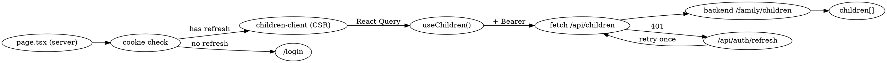

# GMD Phase 1.2-web — Кабинет родителя: управление детьми

**Дата:** 2026-04-19
**Фаза:** 1.2-web
**Зависит от:** Phase 1.1-web (Login + Cabinet, v0.4.1), Phase 1.2 backend (Child Invite + Device, v0.5.0)

## Цель

Родитель в web-кабинете может: создать ребёнка, выдать invite-QR, увидеть статус устройства, сбросить устройство и удалить ребёнка. Функциональность backend API из Phase 1.2 получает пользовательский интерфейс.

## Scope

**Входит:**

- Страница `/cabinet/children`: список детей с информацией об устройстве.
- Модалки: создать ребёнка, редактировать (name/dateOfBirth), удалить с подтверждением по имени.
- Модалка QR-инвайта: QR-картинка, код крупно, таймер до `expiresAt`, кнопка «Обновить код».
- Кнопка reset-device с подтверждением.
- Бейдж статуса устройства: «Не привязано» / «Онлайн» (`lastSeenAt < 5 мин`) / «Был в сети N мин/ч назад».
- Next.js route-handlers `/api/children/*` — прокси backend с access-token из заголовка.
- Клиентский слой: React Query + fetch-обёртка с одноразовым retry после 401 (refresh access-token).
- shadcn/ui компоненты: Dialog, Button, Input, Toast, Tooltip, Badge.
- Toast-уведомления на успех/ошибку.
- Шапка `/cabinet/*` со ссылками «Главная» / «Мои дети» / выход.
- Playwright e2e: full-flow add → invite → reset → delete.

**Не входит** (следующие фазы):

- Polling `lastSeenAt` — Phase 2.
- Страница ребёнка `/cabinet/children/[id]` с историей устройств — YAGNI MVP.
- Avatar-загрузка (MinIO) — Phase 2+.
- Страница `/cabinet/family` для members — Phase 1.3.
- Smart-status «в сети сейчас» через WebSocket — не на MVP.

## Решения (brainstorming)

| Вопрос                  | Решение                                       | Почему                                   |
| ----------------------- | --------------------------------------------- | ---------------------------------------- |
| Scope                   | B: Полный CRUD + lifecycle                    | 1:1 покрывает backend Phase 1.2          |
| Маршрут                 | `/cabinet/children`                           | Отдельная страница, `/cabinet` — визитка |
| CRUD UI                 | Модалки, не отдельные страницы                | Быстро, привычно, меньше навигации       |
| QR либа                 | `qrcode.react`                                | Легковесная, SSR-safe, 8KB               |
| Content QR              | URL `{CLAIM_LANDING_BASE_URL}/claim/{code}`   | Backend уже возвращает готовый `qrUrl`   |
| Delete confirm          | Ввод имени ребёнка                            | Защита от случайного клика, ПДн          |
| Статус устройства       | Бейдж с relative-time                         | Компактно, ясно                          |
| Авто-обновление статуса | Кнопка «Обновить»                             | Polling YAGNI, child-apps пока нет       |
| State-lib               | React Query                                   | Стандарт для server-state в Next.js      |
| Auth-state              | Остаётся Zustand                              | Уже в проекте, не ломаем                 |
| Forms                   | react-hook-form + zod + `@hookform/resolvers` | Минимум boilerplate                      |
| UI kit                  | shadcn/ui                                     | Уже в стеке CLAUDE.md                    |
| API-слой                | Next.js route handlers proxy                  | Уже так сделано для `/api/me`            |
| 401 handling            | Один retry через `/api/auth/refresh`          | Symmetric с cabinet-client               |
| CHANGELOG               | v0.6.0 (MINOR)                                | Заметная пользовательская фича           |

## Архитектура

### Маршруты

```
apps/web/
├── app/
│   ├── cabinet/
│   │   ├── layout.tsx                          NEW: шапка + providers
│   │   ├── page.tsx                            без изменений (visitka)
│   │   ├── cabinet-client.tsx                  minor: ссылка «Мои дети»
│   │   └── children/
│   │       ├── page.tsx                        NEW: server guard → client
│   │       └── children-client.tsx             NEW: список + dialogs
│   ├── api/
│   │   ├── children/
│   │   │   ├── route.ts                        NEW: GET list, POST create
│   │   │   └── [id]/
│   │   │       ├── route.ts                    NEW: PATCH, DELETE
│   │   │       ├── invites/route.ts            NEW: POST
│   │   │       └── reset-device/route.ts       NEW: POST
│   │   └── me/route.ts                         без изменений
│   └── globals.css                             + shadcn CSS vars
├── components/
│   ├── ui/                                     NEW: shadcn generated
│   │   ├── dialog.tsx
│   │   ├── button.tsx
│   │   ├── input.tsx
│   │   ├── label.tsx
│   │   ├── badge.tsx
│   │   ├── tooltip.tsx
│   │   └── toast.tsx / sonner.tsx
│   ├── providers/
│   │   └── query-provider.tsx                  NEW: React Query provider
│   ├── cabinet/
│   │   └── cabinet-header.tsx                  NEW: навигация
│   └── children/
│       ├── children-list.tsx
│       ├── child-card.tsx
│       ├── device-status-badge.tsx
│       ├── create-child-dialog.tsx
│       ├── edit-child-dialog.tsx
│       ├── delete-child-dialog.tsx
│       ├── invite-qr-dialog.tsx
│       └── reset-device-dialog.tsx
├── lib/
│   ├── api/
│   │   ├── client.ts                           NEW: fetch + 401 retry
│   │   └── children.ts                         NEW: типы + функции
│   ├── hooks/
│   │   ├── use-children.ts                     NEW: React Query hooks
│   │   └── use-invite-timer.ts                 NEW: ticking countdown
│   ├── backend.ts                              без изменений
│   └── auth-store.ts                           без изменений
├── tests/e2e/
│   └── children.spec.ts                        NEW: Playwright
├── components.json                             NEW: shadcn config
└── package.json                                + 7 зависимостей
```

### Data flow



### shadcn/ui инициализация

```bash
cd apps/web
pnpm dlx shadcn@latest init --yes \
  --base-color neutral \
  --css-variables \
  --tailwind-config tailwind.config.ts
pnpm dlx shadcn@latest add button dialog input label badge tooltip sonner
```

Результат: `components.json`, `components/ui/*`, обновлённый `globals.css` с CSS-переменными.

### Route handlers (Next.js)

Обёртка, общая для всех `/api/children/*`:

```typescript
// apps/web/app/api/children/_helpers.ts
import 'server-only';
import { NextResponse, type NextRequest } from 'next/server';
import { backend } from '@/lib/backend';

export function getBearer(req: NextRequest): string | null {
  const h = req.headers.get('authorization');
  return h?.startsWith('Bearer ') ? h.slice(7) : null;
}

export function unauth(): NextResponse {
  return NextResponse.json(
    { error: { code: 'unauthorized', message: 'Missing Bearer token' } },
    { status: 401 },
  );
}

export async function proxy(
  method: 'GET' | 'POST' | 'PATCH' | 'DELETE',
  path: string,
  req: NextRequest,
  body?: unknown,
): Promise<NextResponse> {
  const token = getBearer(req);
  if (!token) return unauth();
  const r = await backend(method, path, body, token);
  return NextResponse.json(r.body ?? {}, { status: r.status });
}
```

Пример реализации:

```typescript
// apps/web/app/api/children/route.ts
export async function GET(req: NextRequest) {
  return proxy('GET', '/family/children', req);
}
export async function POST(req: NextRequest) {
  const body = await req.json();
  return proxy('POST', '/family/children', req, body);
}

// apps/web/app/api/children/[id]/invites/route.ts
export async function POST(req: NextRequest, ctx: { params: Promise<{ id: string }> }) {
  const { id } = await ctx.params;
  return proxy('POST', `/family/children/${id}/invites`, req);
}
```

### Client API (браузер)

```typescript
// apps/web/lib/api/client.ts  (runs in browser)
import { useAuthStore } from '@/lib/auth-store';

export class ApiError extends Error {
  constructor(
    public status: number,
    public code: string,
    message: string,
  ) {
    super(message);
  }
}

export async function apiFetch<T>(path: string, init: RequestInit = {}): Promise<T> {
  const token = useAuthStore.getState().accessToken;
  const doFetch = (t: string | null) =>
    fetch(path, {
      ...init,
      headers: {
        'Content-Type': 'application/json',
        ...(t ? { Authorization: `Bearer ${t}` } : {}),
        ...init.headers,
      },
    });
  let res = await doFetch(token);
  if (res.status === 401) {
    // single refresh retry
    const r = await fetch('/api/auth/refresh', { method: 'POST' });
    if (r.ok) {
      const data = await r.json();
      useAuthStore.getState().setAll({
        accessToken: data.accessToken,
        user: data.user,
        family: data.family,
      });
      res = await doFetch(data.accessToken);
    }
  }
  const text = await res.text();
  const body = text ? JSON.parse(text) : null;
  if (!res.ok) {
    const err = body?.error ?? { code: 'unknown', message: res.statusText };
    throw new ApiError(res.status, err.code, err.message);
  }
  return body as T;
}
```

```typescript
// apps/web/lib/api/children.ts
export interface ChildDevice {
  id: string;
  deviceName: string | null;
  osVersion: string | null;
  appVersion: string | null;
  lastSeenAt: string | null; // ISO
  revokedAt: string | null;
}
export interface Child {
  id: string;
  name: string;
  dateOfBirth: string | null;
  device: ChildDevice | null;
}
export interface InviteResponse {
  code: string;
  qrUrl: string;
  deepLink: string;
  expiresIn: number; // секунд
}

export const childrenApi = {
  list: () => apiFetch<{ children: Child[] }>('/api/children'),
  create: (body: { name: string; dateOfBirth?: string }) =>
    apiFetch<{ child: Child }>('/api/children', {
      method: 'POST',
      body: JSON.stringify(body),
    }),
  update: (id: string, body: { name?: string; dateOfBirth?: string | null }) =>
    apiFetch<{ child: Child }>(`/api/children/${id}`, {
      method: 'PATCH',
      body: JSON.stringify(body),
    }),
  remove: (id: string) => apiFetch<void>(`/api/children/${id}`, { method: 'DELETE' }),
  createInvite: (id: string) =>
    apiFetch<InviteResponse>(`/api/children/${id}/invites`, { method: 'POST' }),
  resetDevice: (id: string) =>
    apiFetch<void>(`/api/children/${id}/reset-device`, { method: 'POST' }),
};
```

### React Query hooks

```typescript
// apps/web/lib/hooks/use-children.ts
export function useChildren() {
  return useQuery({ queryKey: ['children'], queryFn: childrenApi.list });
}
export function useCreateChild() {
  const qc = useQueryClient();
  return useMutation({
    mutationFn: childrenApi.create,
    onSuccess: () => qc.invalidateQueries({ queryKey: ['children'] }),
  });
}
// ... useUpdateChild, useDeleteChild, useCreateInvite, useResetDevice
```

### Компоненты (эскизы)

**ChildCard** — карточка:

```
┌──────────────────────────────────────────┐
│  [Avatar]  Ваня                    [···] │
│            6 лет                          │
│            • Устройство: Онлайн           │
│                                           │
│  [QR для привязки]  [Сбросить устройство] │
└──────────────────────────────────────────┘
```

Меню `[···]` → Редактировать / Удалить.

**DeviceStatusBadge:**

- Нет устройства → серый бейдж «Не привязано»
- `lastSeenAt = null` (новое устройство, ещё не ходило) → синий «Привязано»
- `lastSeenAt < 5 min ago` → зелёный «Онлайн»
- `< 1h` → жёлтый «N мин назад»
- `< 24h` → серый «N ч назад»
- Иначе → серый «DD.MM в HH:mm»
- `revokedAt != null` → серый «Отозвано»

**InviteQrDialog:**

```
┌──────────────────────────────┐
│  Привязка устройства         │
│  ──────────────────          │
│      [QR 256×256]            │
│                              │
│      K4 HJ 9X PN             │
│      (крупно, с пробелами)   │
│                              │
│   Код действителен 9:42      │
│                              │
│   [Новый код]  [Закрыть]     │
└──────────────────────────────┘
```

Логика: при открытии → `createInvite(childId)` → локальный state `{code, qrUrl, expiresAt = now + expiresIn*1000}`. Хук `useInviteTimer(expiresAt)` тикает раз в секунду, показывает `mm:ss`. По истечении — сообщение «Код истёк» и кнопка «Обновить».

**DeleteChildDialog:** поле ввода имени ребёнка; кнопка «Удалить» активна только если введённое имя совпадает.

### Шапка кабинета

```typescript
// apps/web/components/cabinet/cabinet-header.tsx
<header class="border-b">
  <nav>
    <Link href="/cabinet">Главная</Link>
    <Link href="/cabinet/children">Мои дети</Link>
  </nav>
  <div>
    <span>{user.email}</span>
    <LogoutButton />
  </div>
</header>
```

### Layout

```typescript
// apps/web/app/cabinet/layout.tsx
export default function CabinetLayout({ children }) {
  return (
    <QueryProvider>
      <Toaster />
      <CabinetHeader />
      <main>{children}</main>
    </QueryProvider>
  );
}
```

Layout не делает server-side auth guard — он уже есть в `page.tsx` каждой подстраницы.

## Dependencies

Добавить в `apps/web/package.json`:

```json
{
  "dependencies": {
    "@tanstack/react-query": "^5.59.0",
    "@hookform/resolvers": "^3.9.0",
    "react-hook-form": "^7.53.0",
    "qrcode.react": "^4.0.1",
    "sonner": "^1.5.0",
    "class-variance-authority": "^0.7.0",
    "clsx": "^2.1.1",
    "tailwind-merge": "^2.5.0",
    "lucide-react": "^0.445.0",
    "@radix-ui/react-dialog": "^1.1.2",
    "@radix-ui/react-label": "^2.1.0",
    "@radix-ui/react-tooltip": "^1.1.3",
    "@radix-ui/react-slot": "^1.1.0"
  }
}
```

(shadcn/ui init добавит radix + cva + clsx автоматически; список выше — финальное состояние.)

## Testing

### Unit (Jest + React Testing Library)

- `device-status-badge.test.tsx`: 6 веток — null, online, N min, N h, дата, revoked.
- `delete-child-dialog.test.tsx`: кнопка неактивна при несовпадении имени.
- `use-invite-timer.test.tsx`: правильный формат mm:ss, expired state.

(RTL уже не стоит — добавляем `@testing-library/react`, `@testing-library/jest-dom`, `jsdom` в dev-deps.)

### E2E (Playwright)

`apps/web/tests/e2e/children.spec.ts`:

1. Login → `/cabinet/children` пустой.
2. Создать ребёнка «Ваня», дата рождения 2020-05-01 → в списке.
3. Открыть «QR для привязки» → видим код 8 chars + таймер.
4. Через API прямой `POST /child/claim` → успешно.
5. Обновить страницу → бейдж «Привязано».
6. Reset-device → confirm → бейдж «Не привязано».
7. Редактировать → имя «Иван» → отражается.
8. Удалить → ввод «Иван» → карточка исчезла.

Используем `gmdTestAuth` хелпер (логин через backend `/auth/*` напрямую с pre-seeded OTP или через override `OTP_DEV_CODE`). В Phase 1.1-web уже есть смоук-тест — переиспользуем паттерн.

### Типы и lint

```
pnpm --filter @gmd/web typecheck
pnpm --filter @gmd/web lint
pnpm --filter @gmd/web build
```

## Env

Без изменений (web не требует новых переменных). Backend URL уже `BACKEND_URL` в `.env.local` / prod env.

## Observability

Ошибки на клиенте — `console.error` + Toast. GlitchTip-интеграция — Phase 0.4 (параллельно).

## Критерии приёмки

- [ ] `pnpm --filter @gmd/web build` зелёный, `typecheck` + `lint` clean.
- [ ] `/cabinet/children` рендерится, пустой state — «Детей пока нет. Добавьте первого ребёнка».
- [ ] Создание → появляется в списке без перезагрузки.
- [ ] QR-диалог показывает картинку, код, таймер; по истечении — «Обновить».
- [ ] После claim через curl — refresh → badge «Привязано».
- [ ] Reset-device — badge → «Не привязано» за один клик + confirm.
- [ ] Edit — save без закрытия страницы, обновление мгновенное.
- [ ] Delete — через ввод имени, карточка пропадает.
- [ ] Playwright `children.spec.ts` зелёный локально.
- [ ] CHANGELOG v0.6.0 с категорией «Новые возможности — Управление детьми».
- [ ] git tag v0.6.0.
- [ ] Deploy на prod — `/cabinet/children` доступен на https://gmd.link28rus.ru.

## Открытые вопросы для writing-plans

1. Где seed-тест-пользователь для Playwright? Вариант: `apps/backend` имеет `OTP_DEV_CODE=123456` — используем в e2e.
2. QR — `qrcode.react` даёт SVG; размер 256×256 фиксом или responsive? Рекомендую фикс 256×256 и `max-w-full`.
3. `Sonner` vs `shadcn/toast`: Sonner проще и современнее — рекомендую Sonner.
4. Формат даты рождения в UI: `<input type="date">` (нативный) vs кастомный date-picker? Рекомендую нативный — меньше кода, работает на mobile.
